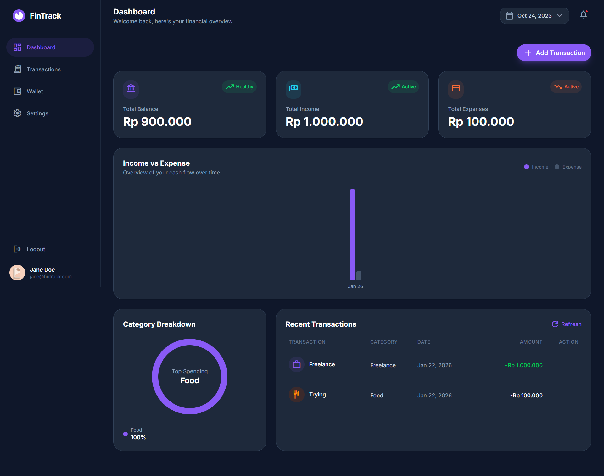
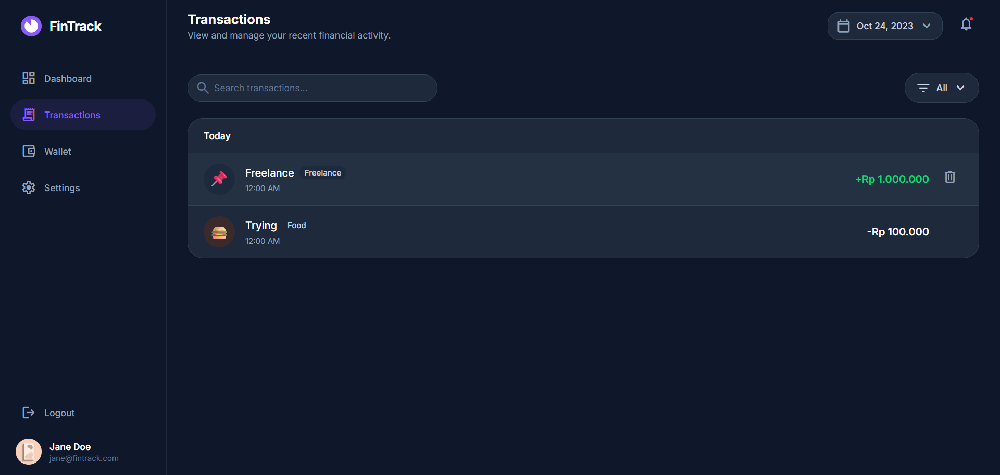
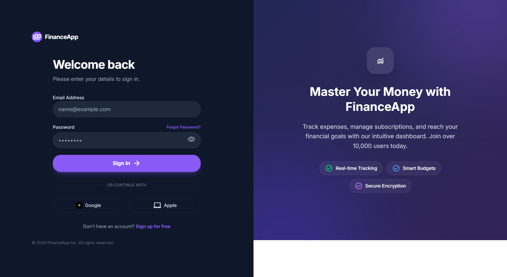
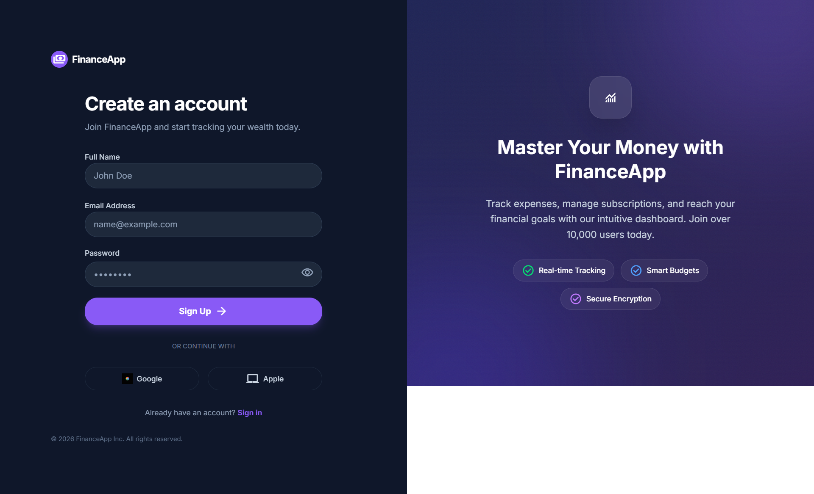

<div align="center">

# 💰 Personal Finance Dashboard

### *Take Control of Your Financial Future*

A sleek, full-stack web application for tracking income and expenses with a modern **Cyberpunk/Dark Mode** aesthetic. Built with React and FastAPI, this dashboard empowers you to visualize your financial health in real-time.

[](https://reactjs.org/)
[](https://www.python.org/)
[](https://fastapi.tiangolo.com/)
[](https://tailwindcss.com/)
[](https://opensource.org/licenses/MIT)

</div>

---

## 📸 Screenshots

> *Add your screenshots here to showcase the application*

| Dashboard Overview | Transaction Management |
|:------------------:|:----------------------:|
|  |  |

| Login Page | Register Page |
|:----------:|:-------------:|
|  |  |

---

## ✨ Features

- 🔐 **JWT Authentication** — Secure login and registration system
- 📊 **Real-time Dashboard** — Interactive charts and income/expense summaries
- 💸 **Transaction Management** — Add, edit, delete, and filter your transactions
- 🗃️ **Data Persistence** — All data stored securely with SQLite
- 📱 **Responsive Design** — Beautiful UI that works on all devices
- 🌙 **Dark Mode Aesthetic** — Modern cyberpunk-inspired interface

---

## 🛠️ Tech Stack

### Frontend
| Technology | Purpose |
|------------|---------|
| **React** | UI Component Library |
| **Vite** | Build Tool & Dev Server |
| **Tailwind CSS v4** | Utility-First Styling |
| **Axios** | HTTP Client |
| **Recharts** | Data Visualization |
| **Lucide React** | Icon Library |

### Backend
| Technology | Purpose |
|------------|---------|
| **Python** | Runtime Environment |
| **FastAPI** | Web Framework |
| **SQLModel** | ORM & Data Validation |
| **SQLite** | Database |
| **Passlib (Bcrypt)** | Password Hashing |
| **PyJWT** | JWT Token Handling |

---

## 📁 Project Structure

```
finance-management/
├── apps/
│   ├── api/                 # 🐍 Backend (FastAPI)
│   │   ├── routers/         # API route handlers
│   │   ├── models/          # SQLModel database models
│   │   ├── main.py          # FastAPI application entry
│   │   └── requirements.txt # Python dependencies
│   │
│   └── web/                 # ⚛️ Frontend (React + Vite)
│       ├── src/
│       │   ├── components/  # React components
│       │   ├── pages/       # Page components
│       │   └── App.jsx      # Main application
│       ├── package.json     # Node dependencies
│       └── vite.config.js   # Vite configuration
│
└── README.md
```

---

## 🚀 Installation & Setup

> ⚠️ **Important:** You will need **TWO separate terminals** to run both the backend and frontend servers simultaneously.

### Prerequisites

- **Python 3.9+** installed
- **Node.js 18+** and npm installed
- **Git** for cloning the repository

### Step 1: Clone the Repository

```bash
git clone https://github.com/yourusername/finance-management.git
cd finance-management
```

---

### Step 2: Backend Setup (Terminal 1) 🐍

```bash
# Navigate to the API directory
cd apps/api

# Create a virtual environment
python -m venv venv

# Activate the virtual environment
# On Windows:
venv\Scripts\activate
# On macOS/Linux:
source venv/bin/activate

# Install dependencies
pip install -r requirements.txt

# Start the backend server
uvicorn main:app --reload --port 8000
```

✅ Backend will be running at: `http://localhost:8000`

📖 API Documentation available at: `http://localhost:8000/docs`

---

### Step 3: Frontend Setup (Terminal 2) ⚛️

```bash
# Navigate to the web directory
cd apps/web

# Install dependencies
npm install

# Start the development server
npm run dev
```

✅ Frontend will be running at: `http://localhost:5173`

---

### 🎉 You're All Set!

Open your browser and navigate to `http://localhost:5173` to start managing your finances!

---

## 📖 API Endpoints

| Method | Endpoint | Description |
|--------|----------|-------------|
| `POST` | `/auth/register` | Register a new user |
| `POST` | `/auth/login` | Login and receive JWT token |
| `GET` | `/transactions` | Get all transactions |
| `POST` | `/transactions` | Create a new transaction |
| `PUT` | `/transactions/{id}` | Update a transaction |
| `DELETE` | `/transactions/{id}` | Delete a transaction |

---

## 🔮 Future Enhancements

- [ ] Budget planning and goal setting
- [ ] Export transactions to CSV/PDF
- [ ] Multi-currency support
- [ ] Recurring transactions
- [ ] Category analytics with AI insights

---

## 🙏 Credits

<div align="center">

**Created by a Computer Science Student** 🎓

*Built with passion and the assistance of* ***Google Antigravity AI*** 🤖

---

⭐ If you found this project helpful, please consider giving it a star!

</div>

---

## 📄 License

This project is licensed under the **MIT License** — see the [LICENSE](LICENSE) file for details.

---

<div align="center">

**Made with ❤️ and ☕**

</div>
